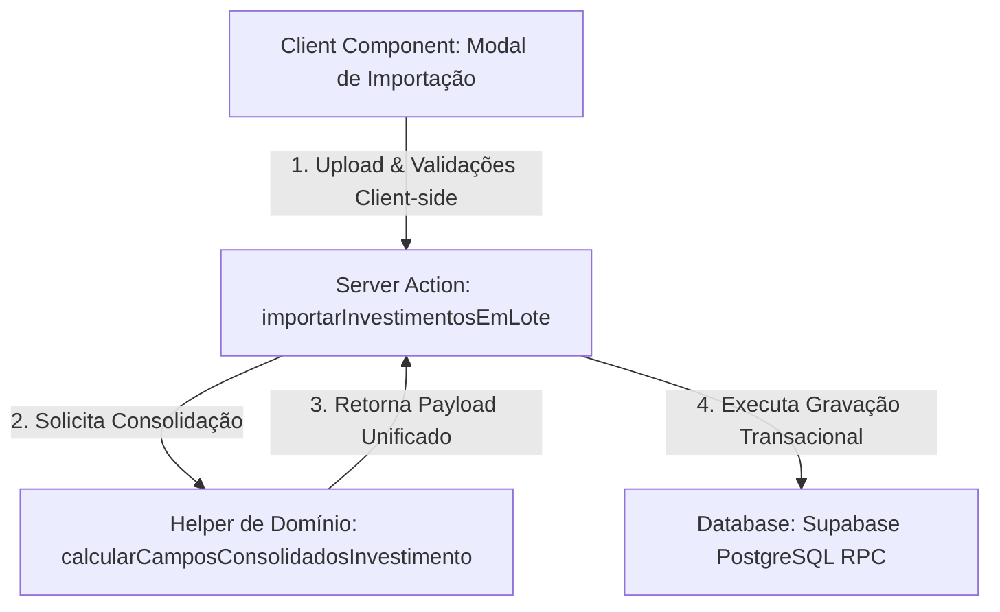

# Módulo de Importação de Investimentos em Lote

Este documento descreve a especificação técnica e de negócios do Módulo de Importação de Investimentos e Planejamento em Lote da plataforma Coffee Mais. 

A partir de 06/07/2026, com o término da fase de homologação e a refatoração para unificação das regras de negócio, este módulo encontra-se **congelado**, aberto apenas para correções críticas de bugs (manutenção corretiva).

---

## 1. Arquitetura do Módulo

O módulo segue uma arquitetura orientada ao domínio, separando estritamente a interface do usuário (Client Components), a orquestração e transporte (Server Actions) e a regra de negócio pura (Helper de Domínio/Módulo Shared).



* **Camada de UI**: Modal interativo em `src/app/investimento/planejamento/page.tsx` e `src/app/investimento/page.tsx` que gerencia o upload do Excel, realiza a simulação visual e mostra feedbacks em tela.
* **Módulo de Domínio**: `src/lib/investimento/consolidacao.ts`. Concentra as regras de negócio de cálculo financeiro e mercadológico de investimentos, garantindo tipagem forte e zero duplicação de lógica.
* **Camada de Orquestração**: Server Actions em `src/app/investimento/lancar/actions.ts` que gerenciam a autenticação, controle de concorrência e chamadas ao banco.
* **Camada de Persistência**: Banco de dados relacional Supabase rodando uma função RPC transacional em PL/pgSQL.

---

## 2. Fluxo de Importação

```
[Upload de Arquivo] -> [Leitura Local / Hash MD5/SHA] -> [Chamada de Simulação]
                                                                |
[Confirmação de Importação] <- [Habilitação do Botão] <- [Pré-Validação e Cálculo]
            |
[Consolidação via Helper] -> [Gravação Transacional RPC] -> [Revalidação de Rotas (revalidatePath)]
```

1. **Upload**: O usuário seleciona ou arrasta uma planilha Excel no modal.
2. **Prevenção de Duplicidade (Client-side)**: É calculado um hash SHA-256 do arquivo no navegador para impedir importações repetidas do mesmo documento.
3. **Simulação**: O arquivo é lido no client (via biblioteca `xlsx`) e enviado à action `simularImportacaoInvestimentos` que realiza validações em lote ("All-or-Nothing").
4. **Consolidação**: Ao clicar em confirmar, a Server Action `importarInvestimentosEmLote` consome o helper compartilhado para calcular médias e volumes de cada ação agrupada.
5. **Gravação**: A Server Action chama a RPC `importar_lote_investimentos` que cria um Job de importação e insere todas as ações vinculadas.
6. **Sincronização**: O Next.js executa a revalidação das rotas `/investimento` e `/investimento/planejamento`.

---

## 3. Modelo de Planilha Aceito

A planilha Excel deve possuir uma aba com nome contendo `"Modelo"`, `"Investimento"` ou `"Planejamento"`. Os cabeçalhos das colunas suportam variações semânticas usuais e devem conter as seguintes informações obrigatórias e opcionais:

| Cabeçalho Excel | Campo Banco de Dados | Obrigatório? | Descrição |
| :--- | :--- | :--- | :--- |
| **Código Matriz** | `codigo_matriz` | **Sim** | Código da rede matriz cadastrada. |
| **Rede** | `rede` | Não (Auto) | Nome comercial da rede (auto-preenchido pelo banco). |
| **Tipo** | `tipo_acao` | **Sim** | Deve conter `"Sell In"` ou `"Sell Out"`. |
| **Pagamento** | `tipo_pagamento` | **Sim** | Deve conter `"Boleto"`, `"Transf. Bancária"` ou `"Bonificação"`. |
| **Mês Ref / Ref** | `mes_referencia` | **Sim** | Período da ação no formato `MM/AAAA`. |
| **Início** | `data_inicio` | **Sim** | Data de início da ação. |
| **Fim** | `data_fim` | **Sim** | Data de término da ação. |
| **Família ou SKU / Abrangência** | `abrangencia` | **Sim** | Classifica se a linha é abrangência `"Família"` ou `"SKU"`. |
| **Família** | `familia_produto` | Condicional | Nome da família (Grar, Moído, etc.) se abrangência for Família. |
| **SKU** | `sku` | Condicional | Código do SKU cadastrado no banco se abrangência for SKU. |
| **Flat** | `preco_flat` | Não | Preço flat (tabela) do item. |
| **Preço Ação** | `preco_acao` | Não | Preço promocional do item na ação. |
| **Investimento** | `investimento` | **Sim** | Valor unitário do investimento da ação. |
| **Volume** | `expectativa_volume` | **Sim** | Volume físico planejado. |

---

## 4. Regras de Negócio e Validações

O sistema consolida múltiplos subitens (linhas da planilha com mesma Rede, Matriz, Tipo, Pagamento, Período e Mês) em uma única ação de investimento no banco. O cálculo é regido pelas seguintes regras:

* **Média Ponderada por Volume**:
  * O valor consolidation de `valor_investimento`, `preco_flat` e `preco_acao` da ação é a média ponderada dos respectivos valores de cada subitem em relação ao volume planejado individual:
    $$\text{Valor Ponderado} = \frac{\sum (\text{Valor Unitário} \times \text{Volume Subitem})}{\sum \text{Volume Subitem}}$$
* **Soma de Volumes**:
  * O `expectativa_volume` do cabeçalho da ação é a soma aritmética dos volumes dos subitens:
    $$\text{Volume Total} = \sum \text{Volume Subitem}$$
* **Nome de Família**:
  * Se a abrangência for **"Família"**, a coluna `familia_produto` concatena os nomes de todas as famílias do grupo separados por vírgula (ex: `"Grão, Cápsula"`).
  * Se a abrangência for **"SKU"**, a coluna `familia_produto` assume o valor fixo `"Múltiplos SKUs"`.
* **Validações de Domínio**:
  * O código da matriz deve existir no cadastro da base de atendimento (`v_redes_matrizes_detalhes`).
  * O SKU deve existir no cadastro geral de produtos.
  * A família deve pertencer ao grupo aceito (`Grão`, `Moído`, `Drip`, `Capsula`, `1KG`).
  * O `preco_acao` não pode ser superior ao `preco_flat`.
  * As datas devem ser válidas e a data de término deve ser posterior à data de início.

---

## 5. Helper Compartilhado (`consolidacao.ts`)

A lógica de consolidação reside exclusivamente no helper puro [consolidacao.ts](file:///Users/cristiano/Projetos/Coffe%20Mais/src/lib/investimento/consolidacao.ts):

* **Interfaces Exportadas**:
  * `SKUDetalhe`: Representa o formato esperado para subitens de SKU.
  * `FamiliaDetalhe`: Representa o formato esperado para subitens de Família.
  * `ConsolidadasRetorno`: Formato do retorno financeiro consolidado.
* **Método**: `calcularCamposConsolidadosInvestimento`
  * Função pura sem efeitos colaterais. Aceita as listas de famílias, SKUs e string opcional de produto, retornando os campos consolidados.

---

## 6. Estrutura de Banco de Dados

```sql
-- Tabela de Lotes de Importação
CREATE TABLE public.cm_import_jobs (
    id UUID PRIMARY KEY DEFAULT gen_random_uuid(),
    nome_arquivo TEXT NOT NULL,
    file_hash TEXT NOT NULL UNIQUE,
    created_at TIMESTAMP WITH TIME ZONE DEFAULT timezone('utc'::text, now()),
    created_by UUID REFERENCES auth.users(id),
    registros_count INTEGER NOT NULL,
    investimento_total NUMERIC NOT NULL,
    status TEXT NOT NULL DEFAULT 'sucesso'::text,
    ip_address TEXT
);

-- Tabela de Ações de Investimento (Ajustada)
ALTER TABLE public.cm_acoes_investimento 
ADD COLUMN import_batch_id UUID REFERENCES public.cm_import_jobs(id) ON DELETE SET NULL;
```

---

## 7. Histórico de Importações e Rollback

* **Histórico**: Cada gravação de lote bem-sucedida cria um cabeçalho em `cm_import_jobs` identificando o arquivo, a pessoa que importou, hash, contagem de registros e total financeiro.
* **Integridade**: A exclusão de um lote (rollback) pode ser feita apagando o registro na tabela `cm_import_jobs`. Como a coluna `import_batch_id` na tabela `cm_acoes_investimento` possui restrição `ON DELETE SET NULL`, a remoção de um job desvincula as ações importadas sem causar exclusão em cascata indesejada, preservando dados para auditoria se necessário.

---

## 8. Testes Unitários

A suite de testes unitários localiza-se em `scripts/test_consolidacao.ts` e pode ser executada com o comando:

```bash
npx ts-node --compiler-options '{"module": "commonjs"}' scripts/test_consolidacao.ts
```

Os cenários validados incluem:
1. **Apenas uma Família**: Cálculo de item único.
2. **Apenas um SKU**: Cálculo de SKU único e geração de `"Múltiplos SKUs"`.
3. **Múltiplas Famílias (Volumes Iguais)**: Validação de média aritmética simples.
4. **Múltiplos SKUs (Volumes Iguais)**: Validação para SKUs.
5. **Volumes Diferentes**: Validação da robustez da média ponderada por volume.
6. **Valores Nulos**: Proteção contra campos incompletos e conversão segura para zero.
7. **Arrays Vazios**: Garantia de valores default de segurança.
8. **Familia_produto Informada**: Garantia de que a entrada explícita é mantida.
9. **Misto**: Comportamento de consolidação híbrida.

---

## 9. Limitações Conhecidas e Roadmap Futuro

### Limitações Conhecidas
* **Desempenho com Lotes Gigantes**: O processamento de planilhas com mais de 5.000 linhas no cliente pode causar lentidão devido ao parsing client-side na thread de UI.
* **Formato de Data**: A planilha necessita que as colunas de data estejam explicitamente formatadas como tipo data ou string compatível (DD/MM/AAAA ou YYYY-MM-DD) no Excel.

### Roadmap Futuro (Backlog para Sprint Futura)
* **Processamento Assíncrono via Queue**: Mover o processamento e parsing para um worker em background, alterando o status do job para `processing` e notificando o usuário ao final via Realtime/Websocket.
* **Desfazer Importação na UI**: Adicionar botão de "Excluir Lote" na interface de auditoria de importações para permitir rollback completo (remoção das ações vinculadas) de forma simplificada para administradores.
