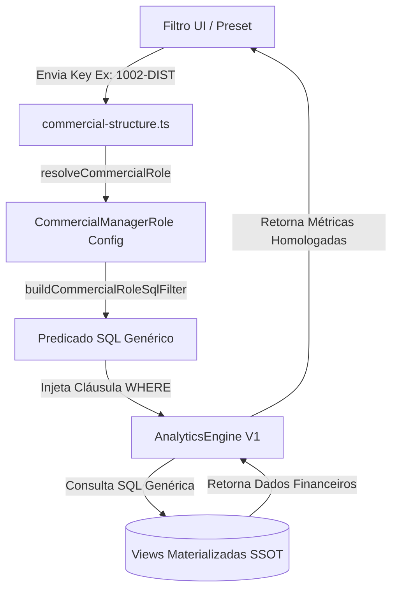

# BASELINE OFICIAL — ESTRUTURA COMERCIAL & COMMERCIAL ROLES v2

> **Status Arquitetural**: `COMMERCIAL_STRUCTURE_V2 = LOCKED & CONFIRMED`  
> **Data de Homologação**: 05/08/2026  
> **Escopo**: Plataforma Coffee++ — Baseline Permanente v1.0  

---

## 1. Visão Geral e Objetivos

O módulo **Commercial Structure v2** (`src/lib/domain/commercial-structure.ts`) é o regulador único e definitivo para a representação, segregação e resolução de gerentes comerciais e suas respectivas funções (**Commercial Roles**) no ecossistema Coffee++.

### Objetivos Principais:
1. **Segregação Funcional Sem Alterar a SSOT do Banco**: Permitir a separação entre gestão de Key Account (`KA`), Distribuidores (`DIST`) e futuras modalidades (`EXPORT`, `FOOD`, `ATACADO`, `PRIVATE_LABEL`, `ECOMMERCE`, `MARKETPLACE`), mantendo a integridade dos dados brutos e views materializadas no banco Supabase (`manager_id = 1002`, `manager_name = Luiz`).
2. **Configuração Unificada (Single Source of Truth)**: Centralizar 100% da inteligência comercial e vínculos de distribuidores no catálogo declarativo `OFFICIAL_COMMERCIAL_ROLES`.
3. **Desacoplamento Absoluto**: Garantir que componentes React, APIs, exportações e a `AnalyticsEngine` não contenham `if/else` soltos ou comparações textuais de rótulos visuais como `"(KA)"` ou `"(Dist)"`.
4. **Validação Automática (Fail-Fast)**: Interromper o build imediatamente (`validateCommercialStructure()`) caso seja introduzida qualquer duplicidade de IDs, labels, códigos de parceiro, matrizes ou aliases.

---

## 2. Arquitetura e Fluxo de Resolução

O fluxo de dados e resolução é 100% determinístico e opera em memória:



### Princípio da Transparência SQL:
- Na UI, a seleção é representada pela chave composta (ex: `1002-KA` ou `1002-DIST`).
- Na camada de domínio, `buildCommercialRoleSqlFilter()` converte a chave no predicado SQL padronizado:
  - Para `1002-KA`: `(manager_id = '1002' AND channel != 'Distribuidor' AND cod_parceiro NOT IN ('212424', '185369', ...) AND UPPER(rede) NOT IN ('SOST', ...))`
  - Para `1002-DIST`: `(manager_id = '1002' AND (channel = 'Distribuidor' OR cod_parceiro IN ('212424', ...) OR UPPER(rede) IN ('SOST', ...)))`
- O banco de dados e a `AnalyticsEngine` permanecem 100% genéricos.

---

## 3. Single Source of Truth (SSOT)

O array `OFFICIAL_COMMERCIAL_ROLES` em `src/lib/domain/commercial-structure.ts` é a **Single Source of Truth** do domínio comercial.

Todos os demais artefatos da aplicação são **derivados dinamicamente em tempo de execução**:
- `DISTRIBUTORS_REGISTRY`: Derivado dinamicamente para compatibilidade.
- `COMMERCIAL_MANAGER_IDS`: Lista de gerentes ativos derivada dinamicamente.
- `COMMERCIAL_ROLE_FILTER_PRESETS`: Presets de filtro derivados dinamicamente.
- `getCommercialManagerRoleOptions()`: Opções de seletor/dropdowns derivadas dinamicamente.
- `ROLE_LOOKUP_MAP`: Mapa de busca e normalização de chaves derivado dinamicamente.

---

## 4. Regras de Evolução e Práticas Proibidas

### 🚨 Regras Proibidas (Bloqueios de Code Review):
1. **PROIBIDO** criar listas paralelas de gerentes ou distribuidores em componentes React, APIs, hooks ou arquivos de constantes locais.
2. **PROIBIDO** comparar strings `"(KA)"` ou `"(Dist)"` no backend, SQL, RPCs ou views materializadas.
3. **PROIBIDO** alterar a `AnalyticsEngine` para tratar `KA` ou `DIST` de forma especializada. A engine deve consumir exclusivamente `buildCommercialRoleSqlFilter()`.
4. **PROIBIDO** cadastrar distribuidores usando apenas busca textual aproximada quando existirem códigos de parceiro (`cod_parceiro` / `partnerCodes`) homologados.

### ✅ Regras de Evolução Permitidas:
- Adicionar novos gerentes, distribuidores ou funções comerciais exclusivamente alterando a lista `OFFICIAL_COMMERCIAL_ROLES` em `src/lib/domain/commercial-structure.ts`.

---

## 5. Exemplos de Configuração

### Exemplo 1: Gerente com Key Account e Distribuidor Vinculado

```ts
{
  id: "1003-KA",
  key: "1003-KA",
  managerId: "1003",
  managerName: "John Guedes",
  role: "KA",
  label: "John Guedes (KA)",
  match: {
    partnerCodes: [],
    matrizCodes: [],
    cnpjs: [],
    aliases: []
  }
},
{
  id: "1003-DIST",
  key: "1003-DIST",
  managerId: "1003",
  managerName: "John Guedes",
  role: "DIST",
  label: "John Guedes (Dist)",
  match: {
    partnerCodes: ["221911", "221912", "118143"],
    matrizCodes: ["221911.1", "221912.1", "118143.1"],
    cnpjs: [],
    aliases: ["BRASSOL", "VIDA E SAUDE DISTRIBUIDORA LTDA", "BRASSOL BRASILIA ALIMENTOS E SORVETES LTDA"]
  }
}
```

---

## 6. Checklists de Evolução

### Checklist A: Cadastro de Novo Distribuidor
1. Obter o `managerId` oficial do gerente responsável.
2. Identificar o `partnerCode` (`cod_parceiro`) e `matrizCode` oficiais no banco.
3. Abrir `src/lib/domain/commercial-structure.ts`.
4. Localizar a role `DIST` do gerente correspondente em `OFFICIAL_COMMERCIAL_ROLES`.
5. Adicionar os códigos em `match.partnerCodes` e os nomes comerciais em `match.aliases`.
6. Executar o **Checklist de Validação Obrigatória**.

### Checklist B: Cadastro de Novo Commercial Role (ex: EXPORT)
1. Abrir `src/lib/domain/commercial-structure.ts`.
2. Adicionar o novo tipo em `CommercialRole` type (ex: `'EXPORT'`).
3. Incluir a nova role em `OFFICIAL_COMMERCIAL_ROLES` com `id: "1002-EXPORT"`, `role: "EXPORT"`, `label: "Luiz (Export)"`.
4. Executar o **Checklist de Validação Obrigatória**.

### Checklist C: Cadastro de Novo Gerente
1. Abrir `src/lib/domain/commercial-structure.ts`.
2. Incluir a entrada `KA` (e `DIST`, se aplicável) em `OFFICIAL_COMMERCIAL_ROLES`.
3. Executar o **Checklist de Validação Obrigatória**.

---

## 7. Checklist de Validação Obrigatória (Fim de Sprint)

Toda e qualquer alteração no `commercial-structure.ts` DEVE obrigatoriamente ser validada e aprovada através dos comandos abaixo:

1. **Checagem de Integridade Estática e Tipagem**:
   ```bash
   npx tsc --noEmit
   ```
2. **Compilação de Produção Next.js**:
   ```bash
   npm run build
   ```
3. **Suíte Completa de Saúde e Governança**:
   ```bash
   npm run health:analytics
   ```
4. **Verificação de Paridade Financeira (Soma Zero)**:
   - Confirmar que para todo gerente: `Valor (KA) + Valor (DIST) = Valor Consolidado`
   - O desvio tolerado é estritamente **R$ 0,0000**.

---

Status: **LOCKED & CONFIRMED IN BASELINE v1.0**
