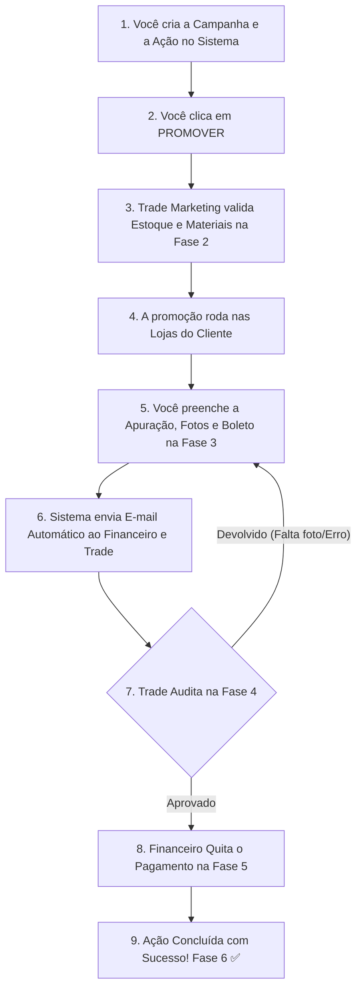

# MANUAL OPERACIONAL DO GERENTE REGIONAL — MÓDULO DE INVESTIMENTOS

> 📌 **Público-Alvo:** Gerentes Regionais Comerciais da Coffee Mais  
> 💡 **Objetivo:** Guia prático e autoexplicativo passo a passo para planejar, cadastrar, acompanhar, apurar e solicitar quitação de verbas comerciais sem complicação.

---

## SUMÁRIO DE NAVEGAÇÃO

1. [O que é o Módulo de Investimentos](#1-o-que-é-o-módulo-de-investimentos)
2. [Quando devo lançar um investimento?](#2-quando-devo-lançar-um-investimento)
3. [Antes de começar (Checklist de Preparação)](#3-antes-de-começar-checklist-de-preparação)
4. [Como criar uma Campanha comercial](#4-como-criar-uma-campanha-comercial)
5. [Como lançar uma Ação Comercial (Campo a Campo)](#5-como-lançar-uma-ação-comercial-campo-a-campo)
6. [Como anexar documentos e relatórios](#6-como-anexar-documentos-e-relatórios)
7. [Como enviar a ação para o Trade Marketing](#7-como-enviar-a-ação-para-o-trade-marketing)
8. [O que acontece depois? (Entenda a Esteira de 6 Fases)](#8-o-que-acontece-depois-entenda-a-esteira-de-6-fases)
9. [Como acompanhar o status das suas ações](#9-como-acompanhar-o-status-das-suas-ações)
10. [Como preencher a apuração (Resultado Real de Vendas)](#10-como-preencher-a-apuração-resultado-real-de-vendas)
11. [Como vincular o boleto bancário](#11-como-vincular-o-boleto-bancário)
12. [Como funciona o processo de aprovação](#12-como-funciona-o-processo-de-aprovação)
13. [Como acompanhar o pagamento pelo Financeiro](#13-como-acompanhar-o-pagamento-pelo-financeiro)
14. [Carta de Anuência: Quando e como utilizar](#14-carta-de-anuência-quando-e-como-utilizar)
15. [Perguntas Frequentes (FAQ)](#15-perguntas-frequentes-faq)
16. [Principais erros dos gerentes e como evitá-los](#16-principais-erros-dos-gerentes-e-como-evitá-los)
17. [Boas práticas de gestão comercial](#17-boas-práticas-de-gestão-comercial)
18. [Fluxograma visual do processo](#18-fluxograma-visual-do-processo)
19. [Checklist final antes de submeter](#19-checklist-final-antes-de-submeter)
20. [Guia Rápido de Bolso ("Cola" de Operação)](#20-guia-rápido-de-bolso-cola-de-operação)

---

## 1. O QUE É O MÓDULO DE INVESTIMENTOS

O **Módulo de Investimentos** é a sua ferramenta oficial dentro da plataforma Coffee Mais para registrar, gerenciar e solicitar o pagamento de todas as verbas comerciais e ações promocionais combinadas com os seus clientes (redes de supermercados e distribuidores).

### Por que ele é importante para você?
- **Segurança de Pagamento:** É a única forma de garantir que o boleto ou abatimento do seu cliente seja pago no prazo certo pelo Financeiro.
- **Transparência Total:** Você acompanha em tempo real em qual mesa ou fase a sua verba está parada (Trade, Financeiro ou Aguardando Apuração).
- **Sem Troca de E-mails Perdidos:** Chega de enviar comprovantes por e-mail ou WhatsApp. Tudo fica salvo em um único lugar seguro.

---

## 2. QUANDO DEVO LANÇAR UM INVESTIMENTO?

Você deve cadastrar uma ação no módulo sempre que fechar um acordo comercial com um cliente que envolva contrapartida financeira ou bonificação.

### Exemplos comuns de quando lançar:
- 🛒 **Tabloide / Encarte de Promoção:** O cliente colocou o Café Moído 250g em oferta no jornal da rede.
- 🎯 **Ponta de Gôndola / Top de Fita:** Negociação de espaço nobre de exposição na loja física.
- ☕ **Ação de Degustação:** Contratação de promotoras para servir café quentinho na loja durante o final de semana.
- 📉 **Desconto de Sell-Out:** Acordo de redução temporária de preço na ponta para acelerar o giro do estoque.
- 📦 **Inauguração de Loja / Aniversário da Rede:** Verba institucional de participação em eventos do cliente.

> ⚠️ **Atenção:** NUNCA autorize um cliente a descontar um boleto ou realizar uma ação sem antes ter cadastrado e promovido o investimento no sistema com antecedência!

---

## 3. ANTES DE COMECAR (CHECKLIST DE PREPARAÇÃO)

Antes de abrir a tela de lançamento, certifique-se de ter em mãos as seguintes informações:

- [ ] **Nome exato da Rede/Matriz Comercial** (ex: *Supermercados Guanabara*).
- [ ] **Data de início e fim da promoção** (ex: *10/08/2026 a 20/08/2026*).
- [ ] **Produtos participantes** (ex: *Linha de Cápsulas* ou *Café Grão 1KG*).
- [ ] **Valores acordados:** Preço normal (Flat), Preço em promoção e Valor unitário do investimento.
- [ ] **Expectativa de volume de vendas** (em Caixas, Unidades ou Quilogramas).
- [ ] **Forma de pagamento negociada** (Boleto bancário, Abatimento em nota ou Bonificação em mercadoria).

---

## 4. COMO CRIAR UMA CAMPANHA COMERCIAL

Todas as ações individuais devem pertencer a uma **Campanha**. A Campanha funciona como uma "pasta mãe" ou orçamento global sob a sua responsabilidade.

### Passo a passo para criar a Campanha:
1. No menu lateral da plataforma, clique em **Investimento** -> **Planejamento** (ou **Lançar**).
2. Clique no botão superior **`+ Nova Campanha`**.
3. Preencha o **Nome da Campanha** (ex: *Campanha Dia dos Pais 2026 - Regional SP*).
4. Defina o **Orçamento Total Reservado** para essa campanha (ex: *R$ 50.000,00*).
5. Defina a data de **Início** e **Fim** da campanha.
6. Clique em **`Salvar Campanha`**.

> 💡 **Dica de Ouro:** Como Gerente Regional, você é o dono da sua Campanha. Todas as ações que você criar dentro dela carregarão automaticamente o seu nome como responsável comercial!

---

## 5. COMO LANÇAR UMA AÇÃO COMERCIAL (CAMPO A CAMPO)

Acesse a tela de lançamento em **Investimento** -> **Lançar Novo** e preencha o formulário conforme as orientações detalhadas abaixo:

```
+-------------------------------------------------------------------------+
| FORMULÁRIO DE LANÇAMENTO COMERCIAL                                      |
|                                                                         |
| 1. Selecionar Rede  ──> [ Guanabara - RJ                     v ]        |
| 2. Selecionar Campanha ─> [ Promoções 3Q 2026 - Gerente Leo   v ]       |
| 3. Tipo de Ação ──────> [ Tabloide de Oferta                 v ]        |
| 4. Forma Pagamento ───> [ Abatimento em Boleto              v ]        |
| 5. Vigência ──────────> [ 10/08/2026 ] até [ 20/08/2026 ]               |
|                                                                         |
| ── PARÂMETROS COMERCIAIS ────────────────────────────────────────────── |
| Preço Flat: R$ 18,90 | Preço Ação: R$ 14,90 | Invest/UN: R$ 4,00       |
| Volume Planejado: 1.000 CX | Total Investimento: R$ 48.000,00          |
+-------------------------------------------------------------------------+
```

---

### Detalhamento dos Campos do Formulário:

#### 1. Campo: `Rede / Cliente`
* **O que significa:** A matriz comercial ou rede de supermercado onde a ação será executada.
* **Quando preencher:** Sempre no início do formulário.
* **Exemplo real:** `SUPERMERCADOS ZAFFARI (RS)`
* ❌ **Erro comum:** Selecionar a filial errada caso a rede possua múltiplas unidades. Verifique se a UF e a Regional batem com a sua carteira.

#### 2. Campo: `Campanha`
* **O que significa:** A pasta/agrupador orçamentário ao qual essa ação pertence.
* **Quando preencher:** Campo obrigatório.
* **Exemplo real:** `Ações Festival de Inverno 2026`
* ❌ **Erro comum:** Deixar em branco ou selecionar a campanha de outro gerente.

#### 3. Campo: `Tipo de Ação`
* **O que significa:** A mecânica comercial acordada com o cliente.
* **Opções disponíveis:** `Tabloide`, `Ponta de Gôndola`, `Top de Fita`, `Degustação`, `Desconto Sell-Out`, `Rebaixe de Preço`, `Aniversário de Rede`.
* **Exemplo real:** Selecionar `Tabloide` quando o produto sair no encarte impresso/digital do cliente.

#### 4. Campo: `Modalidade de Pagamento`
* **O que significa:** Como o dinheiro será quitado pela Coffee Mais.
* **Opções:**
  * `Abatimento / Boleto`: O cliente desconta o valor em um boleto a vencer.
  * `Transferência Bancária`: Pagamento direto via depósito em conta jurídica da rede.
  * `Bonificação`: Envio de caixa física de café sem cobrança para compensar o valor negociado.

#### 5. Campo: `Vigência (Data Início e Data Fim)`
* **O que significa:** O período em que a promoção estará válida nas lojas físicas.
* **Exemplo real:** `01/09/2026` a `15/09/2026`.
* ❌ **Erro comum:** Colocar a data de lançamento do sistema em vez da data real em que a oferta roda na loja.

#### 6. Campo: `Abrangência (Família ou SKU)`
* **O que significa:** Se o desconto vale para uma categoria inteira (ex: *Todas as Cápsulas*) ou para um produto específico (ex: *Café Moído 250g Clássico*).
* **Exemplo real:** Selecionar a família `Moído` para aplicar a promoção em todas as variações de moído.

#### 7. Campo: `Preço Flat (Normal)`
* **O que significa:** O preço de venda regular do produto no supermercado fora da promoção.
* **Exemplo real:** `R$ 19,90` por embalagem.

#### 8. Campo: `Preço da Ação (Promocional)`
* **O que significa:** O preço de oferta final estampado na prateleira para o consumidor.
* **Exemplo real:** `R$ 15,90` por embalagem.

#### 9. Campo: `Investimento Unitário`
* **O que significa:** Quanto a Coffee Mais está pagando de subsídio por cada unidade vendida.
* **Fórmula simples:** $\text{Preço Flat} - \text{Preço Ação} = \text{Investimento Unitário}$ (ex: $19,90 - 15,90 = \text{R\$ 4,00}$).

#### 10. Campo: `Volume Planejado`
* **O que significa:** A quantidade esperada de vendas durante a promoção.
* **Exemplo real:** `500` caixas.
* 💡 **Nota do Sistema:** O sistema converte automaticamente o volume de Caixas para Unidades e Quilogramas de forma perfeita, sem que você precise fazer contas na calculadora!

---

## 6. COMO ANEXAR DOCUMENTOS E RELATÓRIOS

Para comprovar a ação promocional e aprovar a verba, a inclusão de comprovantes é fundamental.

### Quais documentos anexar em cada fase?
* **Fase de Planejamento (Opcional):** Proposta comercial assinada pelo comprador ou e-mail de negociação em PDF.
* **Fase de Apuração (Obrigatório):**
  1. 📄 **Relatório de Sell-Out do Cliente:** Extrato do portal do cliente mostrando as vendas reais no período.
  2. 📸 **Fotos das Gôndolas / Encarte:** Foto nítida da ponta de gôndola montada ou foto do jornal promocional com o preço visível.

### Como anexar na tela:
1. No formulário de apuração, clique no botão **`Selecionar arquivo (PDF ou Imagem)...`**.
2. Escolha o arquivo no seu computador ou celular.
3. Aguarde a barra de progresso verde indicar **"Arquivo Carregado"**.

---

## 7. COMO ENVIAR A AÇÃO PARA O TRADE MARKETING

Quando você preenche o formulário de lançamento, a ação fica salva como um **Rascunho**. Isso significa que ela é apenas uma anotação sua e ainda não entrou na fila da empresa.

### Para oficializar o lançamento:
1. Vá na tela de **Planejamento**.
2. Localize a linha da ação cadastrada.
3. Clique no botão de ação **`Promover`** (ou **`Promover Selecionadas`**).
4. O status da ação mudará para **Fase 1 (Ativa)** e um botão chamado **`Passar para o Trade`** ficará disponível.
5. Clique em **`Passar para o Trade`**. 

PRONTO! A sua ação agora está oficialmente na esteira do Trade Marketing para validação de estoque e materiais!

---

## 8. O QUE ACONTECE DEPOIS? (ENTENDA A ESTEIRA DE 6 FASES)

A sua ação percorre um caminho de 6 fases com responsabilidades bem definidas:

```
┌──────────────┐     ┌──────────────┐     ┌──────────────┐
│   FASE 1     │ ──> │   FASE 2     │ ──> │   FASE 3     │
│ Planejamento │     │  Validação   │     │  Apuração &  │
│  Comercial   │     │    Trade     │     │    Boleto    │
└──────────────┘     └──────────────┘     └──────────────┘
                                                 │
                                                 ▼
┌──────────────┐     ┌──────────────┐     ┌──────────────┐
│   FASE 6     │ <── │   FASE 5     │ <── │   FASE 4     │
│ Concluído ✅ │     │ Pagamento    │     │ Auditoria    │
│ (Imutável)   │     │ Financeiro   │     │ Trade        │
└──────────────┘     └──────────────┘     └──────────────┘
```

* **Fase 1 — Planejamento Comercial (Sua Responsabilidade):** Cadastro e promoção da ação.
* **Fase 2 — Validação Trade (Mesa do Trade):** O Trade confere se há estoque no CD e se o material promocional foi enviado para a equipe de campo.
* **Fase 3 — Apuração & Boleto (Sua Responsabilidade):** Após o término da promoção, você entra no sistema, digita os números reais de vendas, anexa fotos e escolhe o boleto bancário.
* **Fase 4 — Auditoria Trade (Mesa do Trade):** O Trade confere se o seu relatório de vendas bate com as fotos enviadas. Se estiver tudo OK, ele **Aprova**. Se tiver erro, ele **Devolve** para você corrigir.
* **Fase 5 — Pagamento (Mesa do Financeiro):** O Financeiro faz o PIX/Depósito ou abate o valor do boleto no sistema e sobe o comprovante bancário.
* **Fase 6 — Concluído (Finalizado pelo Sistema):** A ação recebe o selo verde de concluída (✅). Ninguém mais pode alterar nada e a verba fica 100% quitada e auditada!

---

## 9. COMO ACOMPANHAR O STATUS DAS SUAS AÇÕES

Você pode acompanhar a evolução das suas verbas a qualquer momento pelo painel central:

1. Acesse o menu **Investimento** -> **Dashboard**.
2. Utilize os cartões no topo da tela para filtrar:
   - 🟡 **Em Validação Trade:** Ações aguardando o ok do Trade.
   - 🟣 **Aguardando Apuração:** Ações com promoção já encerrada esperando você preencher o resultado.
   - 🔵 **Em Auditoria Trade:** Ações que você já apurou e que o Trade está conferindo.
   - 🟢 **Em Pagamento / Concluídas:** Ações aprovadas na mesa do Financeiro.

---

## 10. COMO PREENCHER A APURAÇÃO (RESULTADO REAL DE VENDAS)

Assim que a promoção chegar ao fim nas lojas do cliente, a ação entrará automaticamente na **Fase 3 (Apuração)**. Você receberá um aviso no sistema para prestar contas.

### Passo a passo para apurar:
1. Localize a ação na aba **Fase 3: Apuração**.
2. Clique no botão **`Preencher Apuração`**.
3. Preencha os campos obrigatoriamente:
   - **Número do Acordo Comercial do Cliente:** (ex: *ACORDO-2026-994*).
   - **Volume Real Vendido (Sell-Out Real):** Digite a quantidade real informada no relatório do cliente (ex: *1.250 caixas*).
   - **Valor Final Apurado (R$):** O valor total a ser pago com base nas vendas reais.
4. Anexe o relatório em PDF e as fotos das prateleiras.
5. Clique em **`Concluir Apuração`**.

---

## 11. COMO VINCULAR O BOLETO BANCÁRIO

O Financeiro NÃO realiza nenhum pagamento por abatimento sem que um boleto em aberto esteja formalmente vinculado à ação no sistema.

```
+-------------------------------------------------------------------------+
| VINCULAÇÃO DE BOLETO BANCÁRIO (FASE 3)                                  |
|                                                                         |
|  [X] Ação com Pagamento via Abatimento de Boleto                        |
|                                                                         |
|  Buscar Boleto do Cliente:                                              |
|  [ Guanabara - Duplicata nº 88472 - Venc: 30/08/2026 - R$ 15.000,00  v ]|
|                                                                         |
|  Boleto Selecionado com Sucesso! ✅                                     |
+-------------------------------------------------------------------------+
```

### Como vincular:
1. Na tela de Apuração (Fase 3), localize a seção **Documento Financeiro / Boleto**.
2. No campo de busca por palavra-chave, digite o número do título ou o nome do cliente.
3. O sistema exibirá a lista de boletos em aberto no ERP da Coffee Mais para aquela rede.
4. Selecione o boleto correspondente ao valor negociado.
5. Se a ação **NÃO tiver boleto físico** (ex: bonificação em produto ou transferência em conta), marque a caixa `Ação Sem Boleto Físico` e escolha o motivo no menu (ex: *Desconto em Nota* ou *Bonificação de Mercadoria*).

---

## 12. COMO FUNCIONA A PROCESSO DE APROVAÇÃO

Depois que você conclui a apuração (Fase 3), a ação vai para a mesa de **Auditoria do Trade (Fase 4)**.

### O que o Trade analisa na sua apuração?
1. Se as fotos mostram o produto Coffee Mais exposto de acordo com a negociação.
2. Se o relatório de vendas do cliente bate com o valor apurado.
3. Se o boleto vinculado pertence à mesma matriz e possui saldo suficiente.

### Resultados possíveis na Fase 4:
* ✅ **APROVADO:** O Trade valida as evidências e manda a ação direto para o Financeiro pagar (Fase 5).
* 🔄 **DEVOLVIDO:** Se faltar foto, se o boleto estiver errado ou se o valor não bater, o Trade clica em **`Devolver`**. 
  * Você receberá um e-mail informando a devolução.
  * A ação voltará para você na **Fase 3** com uma mensagem explicativa do Trade (ex: *"Favor anexar relatório em PDF legível"*).
  * Basta corrigir a informação e clicar novamente em `Concluir Apuração`.

---

## 13. COMO ACOMPANHAR O PAGAMENTO PELO FINANCEIRO

Após a aprovação pelo Trade na Fase 4, você não precisa realizar mais nenhuma ação! O investimento entra na fila do Financeiro na **Fase 5**.

### O que o Financeiro faz:
1. Realiza o pagamento bancário ou efetua a baixa por abatimento no ERP Sankhya.
2. Faz o upload do **Comprovante de Pagamento em PDF**.
3. Clica em **`Confirmar Pagamento`**.

### Como você confirma que foi pago?
Na sua tela, o status da ação mudará para **Fase 6: Concluído (✅)**. Ao clicar sobre a ação, você poderá visualizar e baixar o comprovante de pagamento bancário anexado pelo Financeiro a qualquer momento!

---

## 14. CARTA DE ANUÊNCIA: QUANDO E COMO UTILIZAR

A **Carta de Anuência** é um documento formal emitido pela Coffee Mais que autoriza a rede de supermercados a efetuar um abatimento financeiro legal em duplicatas a vencer.

```
+-------------------------------------------------------------------------+
| EMISSÃO DE CARTA DE ANUÊNCIA                                            |
|                                                                         |
|  1. Selecionar Rede: [ Supermercados Guanabara                       v ]|
|  2. Logo da Rede: [ ✅ Logo Oficial Carregado em Alta Resolução      ] |
|  3. Ações Vinculadas: [ X ] Ação #1042 - Tabloide Agosto (R$ 5.000,00)  |
|                       [ X ] Ação #1048 - Ponta Gôndola (R$ 3.000,00)    |
|                                                                         |
|  [ IMPRIMIR / GERAR CARTA DE ANUÊNCIA EM PDF ]                          |
+-------------------------------------------------------------------------+
```

### Quando utilizar a Carta de Anuência?
Sempre que a rede parceira exigir uma autorização assinada da diretoria da Coffee Mais para liberar o abatimento de verbas em títulos bancários.

### Passo a passo para emitir a Carta de Anuência:
1. Acesse no menu principal: **Investimento** -> **Carta de Anuência**.
2. Clique em **`+ Nova Carta de Anuência`**.
3. Selecione a **Rede Comercial**.
4. **Verificação de Logo:** O sistema exibirá a logo oficial da rede cadastrada. Se a rede não tiver logo cadastrada, faça o upload do arquivo de imagem do logo no botão **`Upload de Logo`**.
5. Marque quais ações de investimento aprovadas farão parte dessa carta.
6. O sistema calculará o valor total e gerará o documento PDF oficial com a logo da rede e a assinatura da Coffee Mais.
7. Baixe o PDF e envie para o departamento de contas a pagar do seu cliente!

---

## 15. PERGUNTAS FREQUENTES (FAQ)

### Q1: Posso lançar uma promoção que já começou ou que já terminou?
**Resposta:** O ideal é lançar sempre antes da promoção iniciar. Caso ocorra uma negociação de urgência, lance a ação imediatamente e comunique a equipe de Trade Marketing para acelerar a validação da Fase 2.

### Q2: Esqueci de anexar o relatório de sell-out e a ação foi devolvida. O que faço?
**Resposta:** Não entre em pânico! Acesse a ação que está na Fase 3 (Devolvida), abra a apuração, anexe o arquivo correto e clique no botão `Concluir Apuração` novamente.

### Q3: Por que não consigo alterar o nome do Gerente na ação?
**Resposta:** O sistema vincula o nome do gerente comercial automaticamente através da Campanha. Se a ação está no seu nome, é porque pertence a uma campanha cadastrada na sua carteira.

### Q4: O cliente adiou o tabloide para o mês que vem. Preciso cancelar a ação?
**Resposta:** Não! Peça ao Trade Marketing para registrar uma **Divergência de Calendário** na Fase 2. Ele atualizará as datas reais de execução no sistema sem apagar o seu planejamento original.

### Q5: O valor final apurado vendeu mais do que o planejado. Posso alterar o valor total?
**Resposta:** Sim. Na Fase 3 (Apuração), você deve atualizar o valor total com base nas vendas reais demonstradas no relatório do cliente antes de enviar para a auditoria do Trade.

---

## 16. PRINCIPAIS ERROS DOS GERENTES E COMO EVITÁ-LOS

| ❌ Erro Comum | ⚠️ Impacto no Seu Dia a Dia | 💡 Como Evitar (Solução Fácil) |
| :--- | :--- | :--- |
| **Esquecer a ação salva em Rascunho** | A ação não vai para o Trade e o dinheiro não é liberado para pagamento. | Após salvar, vá na tela de Planejamento e clique no botão **`Promover`**! |
| **Anexar fotos escuras ou illegíveis** | O Trade reprova a apuração na Fase 4 e a ação volta para você. | Confira o arquivo antes de subir. Garanta que o preço promocional esteja legível. |
| **Não vincular o boleto bancário** | O Financeiro não consegue pagar e o cliente liga cobrando o abatimento. | Na Fase 3, busque e selecione o boleto em aberto no dropdown do formulário. |
| **Cadastrar a rede com código de matriz errado** | A Carta de Anuência é gerada com o CNPJ errado e o cliente recusa. | Verifique se a UF e a Regional da rede selecionada batem com a unidade negociada. |
| **Deixar ações acumuladas sem apurar** | Descasa o faturamento do mês e trava a verba da regional. | Toda segunda-feira, reserve 15 minutos para apurar as ações encerradas na semana anterior. |

---

## 17. BOAS PRÁTICAS DE GESTÃO COMERCIAL

1. 🗓️ **Planejamento Mensal:** Cadastre todas as ações do mês nos primeiros 5 dias do período para garantir reserva orçamentária.
2. 📱 **Fotos de Campo:** Peça aos promotores de vendas da sua rota para tirarem fotos bem enquadradas da gôndola assim que a oferta entrar no ar.
3. 🤝 **Alinhamento com o Comprador:** Envie a Carta de Anuência gerada pelo sistema para o comprador assim que a ação for aprovada na Fase 4.
4. 📊 **Acompanhamento de Vendas:** Compare o volume planejado com o volume real apurado para entender quais mecânicas promocionais dão mais resultado na sua região!

---

## 18. FLUXOGRAMA VISUAL DO PROCESSO

Acompanhe o caminho simples da sua verba comercial do início ao fim:



---

## 19. CHECKLIST FINAL ANTES DE SUBMETER

Antes de clicar em **`Concluir Apuração`**, faça a última checagem de segurança:

- [ ] O número do acordo comercial da rede está preenchido?
- [ ] O volume real de vendas condiz com o relatório do cliente?
- [ ] O relatório em PDF ou comprovante do portal foi anexado?
- [ ] As fotos da gôndola/encarte estão legíveis e salvas?
- [ ] O boleto bancário correto foi vinculado na tela (ou o checkbox "Sem Boleto" marcado com justificativa)?

---

## 20. GUIA RÁPIDO DE BOLSO ("COLA" DE OPERAÇÃO)

### 📌 Resumão em 4 Passos para o Gerente Regional:

```
+-----------------------------------------------------------------------------+
| COLA DE OPERAÇÃO RÁPIDA — INVESTIMENTOS COFFEE MAIS                         |
|                                                                             |
| STEP 1: LANÇAR & PROMOVER (Início do Mês)                                   |
| Acesse 'Investimento' -> 'Lançar Novo' -> Preencha os dados -> Clique em    |
| 'Promover' -> Clique em 'Passar para o Trade'.                              |
|                                                                             |
| STEP 2: ACOMPANHAR A EXECUÇÃO (Durante a Promoção)                          |
| Acompanhe a ação na Fase 2. Garanta que o promotor de campo organize as     |
| gôndolas e tire fotos do expositor.                                         |
|                                                                             |
| STEP 3: APURAR & VINCULAR BOLETO (Fim da Promoção)                          |
| Acesse 'Fase 3: Apuração' -> Digite o sell-out real -> Anexe os PDFs/fotos  |
| -> Selecione o Boleto do cliente -> Clique em 'Concluir Apuração'.          |
|                                                                             |
| STEP 4: EMITIR CARTA & CONFERIR PAGAMENTO (Pós-Aprovação)                   |
| Se necessário, acesse 'Carta de Anuência' -> Baixe o PDF -> Acompanhe a    |
| baixa financeira na 'Fase 6: Concluído' ✅.                                 |
+-----------------------------------------------------------------------------+
```

---
*Dúvidas operacionais ou problemas de acesso? Entre em contato com a equipe de suporte interno através do e-mail: `suporte@coffeemais.com`.*
