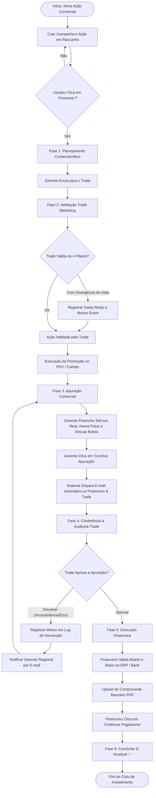
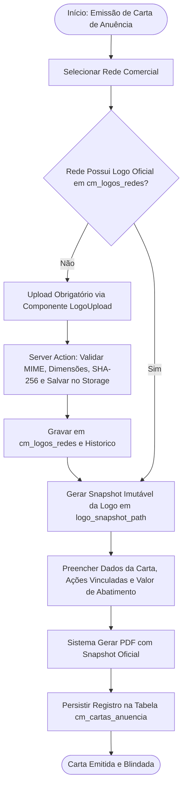

# ESPECIFICAÇÃO FUNCIONAL OFICIAL — MÓDULO DE INVESTIMENTOS

> **Status Arquitetural:** `INVESTIMENTOS_MODULE = LOCKED & CONFIRMED`  
> **Versão do Documento:** 2.0 (Consolidado e Homologado)  
> **Data de Atualização:** 28/07/2026  
> **Single Source of Truth:** Este documento é a especificação técnica e operacional definitiva do Módulo de Investimentos do Coffee++. Substitui e consolida todas as instruções dispersas em manuais legados, páginas de ajuda e registros de governança.

---

## SUMÁRIO DE SEÇÕES

1. [Objetivo do Módulo](#1-objetivo-do-módulo)
2. [Responsáveis por Cada Etapa (Matriz RACI)](#2-responsáveis-por-cada-etapa-matriz-raci)
3. [Pré-requisitos Operacionais e Técnicos](#3-pré-requisitos-operacionais-e-técnicos)
4. [Fluxo Completo do Processo (End-to-End)](#4-fluxo-completo-do-processo-end-to-end)
5. [Regras de Negócio Homologadas](#5-regras-de-negócio-homologadas)
6. [Alçadas e Aprovações](#6-alçadas-e-aprovações)
7. [Tratamento de Exceções & Caminhos Alternativos](#7-tratamento-de-exceções--caminhos-alternativos)
8. [Notificações e Comunicação Automática](#8-notificações-e-comunicação-automática)
9. [Critérios de Encerramento e Blindagem Imutável](#9-critérios-de-encerramento-e-blindagem-imutável)
10. [Fluxogramas em Mermaid](#10-fluxogramas-em-mermaid)
11. [Checklist Operacional de Auditoria](#11-checklist-operacional-de-auditoria)
12. [FAQ — Perguntas Frequentes](#12-faq--perguntas-frequentes)
13. [Boas Práticas de Operação](#13-boas-práticas-de-operação)
14. [Indicadores & KPIs do Módulo](#14-indicadores--kpis-do-módulo)
15. [Anexos e Mapeamento de Telas/Interfaces](#15-anexos-e-mapeamento-de-telasinterfaces)
16. [Modelo de Dados Funcional](#16-modelo-de-dados-funcional)
17. [Máquina de Estados](#17-máquina-de-estados)
18. [Matriz de Permissões por Perfil](#18-matriz-de-permissões-por-perfil)
19. [Eventos do Sistema & Logs de Auditoria](#19-eventos-do-sistema--logs-de-auditoria)
20. [Integrações com Demais Módulos do Ecossistema](#20-integrações-com-demais-módulos-do-ecossistema)
21. [Glossário de Termos do Domínio](#21-glossário-de-termos-do-domínio)
22. [Histórico de Evolução Arquitetural](#22-histórico-de-evolução-arquitetural)

---

## 1. OBJETIVO DO MÓDULO

O **Módulo de Investimentos** é o sistema central de governança, planejamento, validação, apuração, quitação e auditoria de todas as verbas comerciais e ações promocionais de Trade Marketing aplicadas nas redes parceiras da **Coffee Mais**.

### Objetivos Estratégicos:
* **Garantia de Rastreabilidade Financeira:** Impedir o pagamento de qualquer verba comercial que não tenha sido previamente planejada, validada pelo Trade Marketing, comprovada por evidências físicas (sell-out/fotos) e auditada pelo Financeiro.
* **Preservação de Margem e ROI:** Assegurar que as contrapartidas de visibilidade e volume negociadas com os clientes gerem o retorno planejado, com desvio financeiro zero em relação aos dados oficiais do ecossistema.
* **Governança de Cartas de Anuência:** Gerenciar de forma automatizada e imutável as Cartas de Anuência e logotipos das redes parceiras para abatimentos contratuais legítimos.
* **Eliminação de Processos Informais:** Substituir trocas manuais de e-mails, planilhas paralelas e autorizações verbais por uma esteira transacional auditável com 6 fases controladas por máquina de estados.

---

## 2. RESPONSÁVEIS POR CADA ETAPA (MATRIZ RACI)

A execução das atividades do módulo distribui-se entre diferentes papéis operacionais e administrativos.

### Definição da Matriz RACI:
* **R (Responsible):** Quem executa a tarefa.
* **A (Accountable):** Quem responde pela aprovação final e resultado.
* **C (Consulted):** Quem fornece insumos e validações estratégicas.
* **I (Informed):** Quem recebe notificações de acompanhamento.

| Etapa do Processo | Gerente Regional / Comercial | Trade Marketing | Financeiro | Admin / Master | Sistema (Automação) |
| :--- | :---: | :---: | :---: | :---: | :---: |
| **Criação da Campanha & Lançamento de Ações** | **R / A** | C | I | I | I |
| **Ativação / Promoção da Ação (Fase 1)** | **R** | I | I | I | **A** |
| **Validação dos 4 Pilares do Trade (Fase 2)** | I | **R / A** | I | I | I |
| **Execução em Campo & Coleta de Evidências** | **R** | C | I | I | I |
| **Preenchimento da Apuração & Boleto (Fase 3)** | **R / A** | C | I | I | I |
| **Conferência & Auditoria Trade (Fase 4)** | I | **R / A** | I | I | **I** (Disparo de E-mail) |
| **Quitação Bancária / Abatimento (Fase 5)** | I | I | **R / A** | I | I |
| **Encerramento Imutável & Arquivamento (Fase 6)** | I | I | I | I | **R / A** |
| **Gestão de Logos & Emissão de Carta de Anuência** | R | **R / A** | C | A | R |

---

## 3. PRÉ-REQUISITOS OPERACIONAIS E TÉCNICOS

Para que um investimento comercial seja cadastrado e transite com sucesso pela esteira, os seguintes pré-requisitos devem ser atendidos:

### 3.1 Pré-requisitos de Master Data:
1. **Rede Cadastrada e Ativa:** A rede comercial deve existir em `cm_clientes` com código de matriz oficial válido e gerente responsável associado.
2. **SKU / Família Homologada:** Os produtos vinculados devem consumir exclusivamente os fatores de conversão física do Master Data (`cm_skus_conversao` via `ProdutoConversaoService`). É proibido o uso de fatores logísticos hardcoded.
3. **Logotipo Vigente da Rede:** Para emissão de Carta de Anuência, a rede deve possuir logo oficial processado e ativo em `cm_logos_redes` via componente `LogoUpload`.

### 3.2 Pré-requisitos Operacionais:
1. **Orçamento Alocado:** O Gerente Regional deve possuir saldo de verba disponível no período planejado.
2. **Prazo de Antecedência:** Ações de Trade devem ser lançadas com antecedência mínima definida em política comercial em relação à data de início planejada.

---

## 4. FLUXO COMPLETO DO PROCESSO (END-TO-END)

O ciclo de vida de um investimento comercial é composto por **6 Fases sequenciais e obrigatórias**:

```
[Rascunho] ──> (Fase 1: Planejamento) ──> (Fase 2: Validação Trade) ──> (Fase 3: Apuração & Boleto) ──> (Fase 4: Auditoria Trade) ──> (Fase 5: Pagamento) ──> [Fase 6: Concluído (Imutável)]
```

---

### 4.1 Fase 1: Planejamento Comercial
* **Ator Principal:** Gerente Regional Comercial.
* **Objetivo:** Reservar orçamento, definir a mecânica da promoção e prever volumes e margens.
* **Ações:**
  1. O usuário acessa a tela de Lançamento (`/investimento/lancar`).
  2. Seleciona a **Rede**, a **Campanha** (obrigatória), o **Tipo de Ação** (Sell Out, Sell In, Tabloide, Degustação, Top de Fita, Ponta de Gôndola, etc.), a forma de pagamento (Abatimento, Transferência Bancária ou Bonificação) e o período de vigência (`data_inicio` a `data_fim`).
  3. Seleciona a abrangência (**Família de Produtos** ou **SKU Específico**).
  4. Preenche o preço normal (Flat), o preço promocional planejado, o investimento unitário e a expectativa de volume (CX/UN/KG).
  5. O sistema calcula automaticamente o valor total investido e projeta o impacto financeiro.
  6. A ação é salva inicialmente no estado **Rascunho** (planejamento interno).
  7. Ao clicar no botão **`Promover`**, a ação é oficializada e transita para a **Fase 1 (Ativa na Esteira)**, ficando disponível para avanço ao Trade.

---

### 4.2 Fase 2: Validação Trade Marketing
* **Ator Principal:** Analista / Coordenador de Trade Marketing.
* **Objetivo:** Auditagem prévia de viabilidade técnica, operacional e logística antes da veiculação da promoção em campo.
* **Ações:**
  1. O Trade acessa o painel de conferência da Fase 2.
  2. Preenche o **Checklist dos 4 Pilares do Trade**:
     * **Comunicação:** Confirmação do envio de réguas visuais, materiais de PDV e alinhamento com agências/promotores.
     * **Logística:** Validação de saldo de estoque para evitar ruptura durante o pico da promoção.
     * **Auditoria:** Agendamento das rotas de promotores para checagem de preço e fotos de gôndola.
     * **Garantia:** Validação do alinhamento entre o valor negociado e a tabela praticada.
  3. Caso haja **Divergência de Calendário** (alteração nas datas reais de execução por atraso logístico, alteração de encarte ou pedido da rede), o Trade marca a flag `possui_divergencia_calendario = true`, preenche `data_inicio_real`, `data_fim_real`, seleciona o motivo controlado (`motivo_divergencia_enum`) e registra observações.
  4. Ao clicar em **`Validado pelo Trade`**, a ação transita para a **Fase 3 (Em Execução / Aguardando Apuração)**.

---

### 4.3 Fase 3: Apuração Comercial & Vinculação de Boleto
* **Ator Principal:** Gerente Regional Comercial.
* **Objetivo:** Registrar o resultado real pós-evento, anexar comprovantes de sell-out e vincular a cobrança financeira.
* **Ações:**
  1. Concluído o período da promoção, o Gerente Regional clica em **`Preencher Apuração`**.
  2. Preenche o número do acordo comercial da rede, a quantidade real vendida (sell-out real) e o valor final apurado.
  3. Anexa obrigatoriamente os arquivos de evidências (relatórios de portais dos clientes em PDF/Excel, relatórios de apuração, fotos de gôndola ou encartes).
  4. **Vinculação de Boleto / Documento Financeiro:**
     * Para pagamentos via boleto/abatimento: Seleciona o boleto em aberto correspondente no dropdown integrado (buscando pela tabela de boletos do cliente).
     * Para ações sem boleto físico: Seleciona a justificativa cadastrada.
  5. Ao clicar em **`Concluir Apuração`**, o sistema altera o status para a **Fase 4** e dispara automaticamente um e-mail de notificação ao Financeiro e Trade.

---

### 4.4 Fase 4: Auditoria e Conferência de Trade
* **Ator Principal:** Trade Marketing (Audit).
* **Objetivo:** Auditar o dossiê de apuração enviado pelo comercial confrontando evidências e valores.
* **Ações:**
  1. O Trade analisa os comprovantes anexados, os volumes apurados e o vinculo do boleto.
  2. **Decisão A — Aprovar:** Se as evidências estiverem completas e em conformidade, clica em **`Aprovar`**. A ação transita para a **Fase 5 (Financeiro)**.
  3. **Decisão B — Devolver:** Se houver inconsistência nos valores, falta de fotos ou erro no boleto, clica em **`Devolver`**. O sistema registra o histórico de devolução, notifica o Gerente Regional e a ação retorna para a **Fase 3** para correção.

---

### 4.5 Fase 5: Execução Financeira & Quitação
* **Ator Principal:** Analista Financeiro.
* **Objetivo:** Efetuar a liquidação bancária ou a baixa por abatimento no ERP e comprovar a quitação.
* **Ações:**
  1. O Financeiro acessa o painel de quitação da Fase 5.
  2. Confirma o boleto/conta bancária associada e o valor final aprovado.
  3. Executa o pagamento no Internet Banking ou efetua o abatimento do título no ERP Sankhya.
  4. Upload obrigatório do **comprovante bancário/nota de quitação em PDF**.
  5. Clica em **`Confirmar Pagamento`**. O sistema finaliza o ciclo e promove a ação para a **Fase 6**.

---

### 4.6 Fase 6: Concluído e Blindagem Imutável
* **Ator Principal:** Sistema (Automação).
* **Objetivo:** Conclusão definitiva, blindagem contra alterações e registro em auditoria fiscal.
* **Características:**
  1. O status é atualizado para `Concluído` com badge verde oficial (✅).
  2. **Bloqueio Físico de Edição:** Todos os campos da ação, evidências, boletos e formulários de apuração tornam-se estritamente **read-only**.
  3. A linha do tempo completa (logs com timestamp, ID de usuário, IPs e histórico de devoluções) permanece disponível para auditorias fiscais e governança corporativa.

---

## 5. REGRAS DE NEGÓCIO HOMOLOGADAS

As diretrizes abaixo constituem o baseline arquitetural definitivo e permanente do módulo de Investimentos. Qualquer violação causa rejeição no build e na suíte de testes de integridade (`npm run health:analytics`).

### 5.1 Arquitetura de Dados Físicos
* **Modelo 1 Campanha -> N Ações:** O modelo relacional `cm_campanhas (1) -> cm_acoes_investimento (N)` é a estrutura oficial e definitiva. Ações de investimento não existem de forma órfã.
* **Obrigatoriedade de Ownership (`gerente_id`):**
  * `cm_campanhas.gerente_id` é obrigatoriamente `NOT NULL`.
  * `cm_acoes_investimento.campanha_id` é obrigatoriamente `NOT NULL`.
  * **Resolução Única de Gerente:** Toda ação herda seu gerente responsável exclusivamente da campanha pai. É proibido utilizar fallbacks paralelos ou sobreecrever gerentes por regras arbitrárias no frontend.
* **Legado Congelado (Read-Only):** As tabelas antigas (`cm_investimento_familias`, `skus_detalhes`) encontram-se congeladas em somente leitura.

### 5.2 Conversão Logística e Master Data (Sem Hardcoding)
* **Consumo Exclusivo do `ProdutoConversaoService`:** Nenhum cálculo de conversão entre Caixas, Unidades ou Quilogramas pode ser implementado localmente em formulários ou APIs.
* **Proibição Absoluta de Fatores Fixo no Código:** É proibido hardcodear fatores (ex: 12 un/cx, 20 un/cx). Todas as razões físicas devem consultar `cm_skus_conversao`.

### 5.3 Cobertura Comercial da Carteira
* **Fórmula Oficial de Cobertura:**
  $$\text{Cobertura Comercial (\%)} = \left( \frac{\text{Redes com Ação no Período}}{\text{Total de Redes Ativas na Carteira}} \right) \times 100$$
* **Filtros Dinâmicos:** O cálculo de redes com/sem ação deve respeitar integralmente os filtros ativos da tela (gerente, regional, período).

### 5.4 Divergência Operacional de Calendário (Trade Fase 2)
* **Imutabilidade do Planejamento Comercial:** As datas planejadas originais (`data_inicio`, `data_fim`) são imutáveis após a criação da ação.
* **Registro Exclusivo da Execução Real:** Divergências de datas são registradas nos campos dedicados: `data_inicio_real`, `data_fim_real`, `motivo_divergencia_calendario` e `observacao_divergencia`.
* **Estados Válidos (Constraint `chk_divergencia_calendario`):**
  1. *Sem Divergência:* `possui_divergencia_calendario = false` E todos os 4 campos de divergência são `NULL`.
  2. *Com Divergência:* `possui_divergencia_calendario = true` E todos os 4 campos devidamente preenchidos, com `data_inicio_real <= data_fim_real`.
* **Valores Controlados (`motivo_divergencia_enum`):**
  `ATRASO_LOGISTICO`, `ALTERACAO_REDE`, `ALTERACAO_COMERCIAL`, `PROBLEMA_OPERACIONAL_LOJA`, `RUPTURA_ESTOQUE`, `ALTERACAO_ENCARTE`, `OUTROS`.

### 5.5 Gestão de Logos de Redes e Carta de Anuência
* **Eliminação de URLs Textuais:** A gestão do logo da rede é realizada exclusivamente por upload via componente `LogoUpload`.
* **Processamento 100% Server-Side:** A Server Action `processarEUploadLogoRede` valida extensões/MIME, calcula hash SHA-256, redimensiona, gera o `storage_path` e salva no bucket `logos-redes`.
* **Tabelas de Gestão:**
  * `cm_logos_redes`: Armazena o logo oficial vigente (1 registro por `rede_id`).
  * `cm_logos_redes_historico`: Armazena todas as versões anteriores arquivadas.
* **Snapshot Imutável em Cartas Emitidas:** Toda Carta de Anuência gera e armazena um snapshot imutável da logo em `logo_snapshot_path`. Alterações futuras no cadastro da rede não alteram cartas emitidas no passado.
* **Proibição de URLs Absolutas no Banco:** Os caminhos são armazenados como caminhos relativos de storage (`storage_path`). A URL pública é resolvida dinamicamente via `getStoragePublicUrl(...)`.

---

## 6. ALÇADAS E APROVAÇÕES

A navegação pelas fases exige alçadas de autorização específicas para impedir que um usuário aprove suas próprias solicitações sem auditoria cruzada.

```
+-------------------+--------------------+-----------------------+
| Fase da Esteira   | Perfil Solicitante | Alçada de Aprovação   |
+-------------------+--------------------+-----------------------+
| Rascunho -> Fase 1| Gerente Regional   | Auto-aprovação        |
| Fase 1 -> Fase 2  | Gerente Regional   | Envio ao Trade        |
| Fase 2 -> Fase 3  | Trade Marketing    | Validação Trade       |
| Fase 3 -> Fase 4  | Gerente Regional   | Conclusão Apuração    |
| Fase 4 -> Fase 5  | Trade Marketing    | Auditoria Trade       |
| Fase 5 -> Fase 6  | Financeiro         | Quitação Financeira   |
+-------------------+--------------------+-----------------------+
```

* **Trava de Autodevolução:** O Gerente Regional não pode aprovar a ação na Fase 4 (exclusivo do Trade Marketing).
* **Trava de Quitação:** O Trade Marketing e o Gerente Regional não podem quitar a ação na Fase 5 (exclusivo do perfil Financeiro / Admin).

---

## 7. TRATAMENTO DE EXCEÇÕES & CAMINHOS ALTERNATIVOS

### 7.1 Devolução de Apuração (Fase 4 -> Fase 3)
* **Causa:** Evidências fotográficas legíveis ausentes, divergência superior à margem tolerada entre sell-out informado e relatório da rede, ou boleto incorreto.
* **Fluxo de Exceção:**
  1. O analista de Trade seleciona a opção **`Devolver`**.
  2. É obrigatório registrar uma justificativa técnica detalhada no campo de observação.
  3. O sistema altera o status da ação de volta para a **Fase 3**, increments o contador de devoluções (`qtd_devolucoes`), grava a justificativa em `cm_acoes_devolucoes_log` e notifica o Gerente Regional por e-mail.
  4. O Gerente Regional efetua a correção dos dados/anexos e clica novamente em `Concluir Apuração`, reenviando a ação para a Fase 4.

### 7.2 Ações Sem Boleto Físico (Abatimentos Diretos ou Bonificações)
* **Causa:** Ações em que não há emissão de boleto bancário pelo cliente (ex: bonificação em produto ou abatimento em duplicata via nota de crédito).
* **Fluxo de Exceção:**
  1. Na Fase 3, o Gerente marca o checkbox `Ação Sem Boleto Físico`.
  2. Seleciona o motivo estruturado (`motivo_sem_boleto`): `BONIFICACAO_MERCADORIA`, `DESCONTO_EM_NOTA`, `CARTA_ANUENCIA_ABATIMENTO`, `OUTROS`.
  3. O sistema libera o requisito de vínculo bancário, mantendo a exigência dos relatórios de sell-out e fotos de evidência.

### 7.3 Divergência de Calendário Comercial
* **Causa:** A rede adia o tabloide de promoção por problemas operacionais ou atraso na entrega logística.
* **Fluxo de Exceção:**
  1. Na Fase 2, o Trade ativa `possui_divergencia_calendario = true`.
  2. O sistema exige a seleção de um motivo no enum `motivo_divergencia_enum` e o preenchimento de `data_inicio_real` e `data_fim_real`.
  3. O sistema preserva as datas originais para cálculo de SLA comercial e utiliza as datas reais para auditoria de gôndola pelos promotores.

---

## 8. NOTIFICAÇÕES E COMUNICAÇÃO AUTOMÁTICA

O sistema possui um serviço de mensageria integrado (`InvestimentoNotificationService`) que dispara alertas automáticos em eventos críticos da esteira:

### 8.1 Gatilhos de Notificação:

1. **Gatilho 1: Apuração Concluída (Fase 3 -> Fase 4)**
   * **Destinatários:** `financeiro@coffeemais.com`, Liderança de Trade Marketing, Gerente Regional.
   * **Conteúdo:** E-mail HTML formatado contendo resumo da campanha, rede, valor apurado, boleto vinculado e links diretos para download dos anexos de evidência.
2. **Gatilho 2: Ação Devolvida pelo Trade (Fase 4 -> Fase 3)**
   * **Destinatários:** Gerente Regional responsável.
   * **Conteúdo:** Alerta com o motivo detalhado da devolução registrado pelo Trade e link direto para reapuração.
3. **Gatilho 3: Quitação Efetuada (Fase 5 -> Fase 6)**
   * **Destinatários:** Gerente Regional Comercial, Trade Marketing.
   * **Conteúdo:** Confirmação de pagamento efetuado com cópia do comprovante bancário anexado pelo Financeiro.

---

## 9. CRITÉRIOS DE ENCERRAMENTO E BLINDAGEM IMUTÁVEL

Um investimento é considerado **encerrado e blindado** quando atinge o estado `Fase 6: Concluído`.

### Regras de Imutabilidade Físicas e Lógicas:
1. **Bloqueio de UPDATE:** APIs e Server Actions rejeitam qualquer comando `UPDATE` em registros com `fase = 6`, exceto operações executadas pelo perfil `Admin Master` via canal de auditoria registrado.
2. **Preservação de Evidências no Storage:** Arquivos no bucket do Supabase vinculados a ações na Fase 6 possuem trava contra exclusão.
3. **Trilha do Histórico:** O registro mantém o log completo em `cm_audit_logs` e `cm_investimentos_daily_snapshots` contendo:
   * Usuário de criação, promoção, validação, apuração, auditoria e quitação.
   * Timestamps exatos de cada mudança de fase.
   * Hashing das evidências e comprovantes anexados.

---

## 10. FLUXOGRAMAS EM MERMAID

### 10.1 Fluxograma Geral do Processo (End-to-End)



---

### 10.2 Fluxograma de Emissão de Carta de Anuência & Gestão de Logos



---

## 11. CHECKLIST OPERACIONAL DE AUDITORIA

Antes de aprovar ou transitar uma ação de fase, os operadores devem aplicar o checklist abaixo:

### Checklist do Gerente Regional (Fase 1 e Fase 3):
- [ ] A campanha associada está correta e com o gerente responsável atribuído?
- [ ] A abrangência (Família ou SKU) reflete a negociação com a rede?
- [ ] Os preços Flat e Promocional estão alinhados com a tabela comercial vigente?
- [ ] Os comprovantes de apuração (relatório de sell-out do cliente e fotos) foram anexados em formato legível?
- [ ] O boleto bancário selecionado corresponde exatamente ao valor e à rede da ação? (Ou o motivo de isenção de boleto foi preenchido?)

### Checklist do Trade Marketing (Fase 2 e Fase 4):
- [ ] **Comunicação:** A equipe de promotores da regional foi notificada sobre a promoção?
- [ ] **Logística:** Há estoque suficiente no CD do cliente/distribuidor para atender à demanda da promoção?
- [ ] **Auditoria:** Promotores confirmaram a presença dos produtos e etiquetas de preço na gôndola?
- [ ] **Garantia:** Em caso de alteração no calendário, a divergência foi registrada com o motivo correto no enum?
- [ ] **Conferência de Apuração:** O volume real apurado condiz com o relatório enviado pela rede?

### Checklist do Financeiro (Fase 5):
- [ ] O boleto/abatimento cadastrado consta no ERP Sankhya?
- [ ] O valor final aprovado pelo Trade bate com o valor da ordem de pagamento?
- [ ] O comprovante bancário foi salvo no formato PDF e anexado à ação?

---

## 12. FAQ — PERGUNTAS FREQUENTES

### Q1: O que fazer quando uma rede adia uma promoção que já estava na Fase 2?
**Resposta:** O Trade Marketing deve editar a ação na Fase 2, marcar a opção "Possui Divergência de Calendário", selecionar o motivo no dropdown (ex: `ALTERACAO_REDE` ou `ATRASO_LOGISTICO`) e preencher as novas datas reais de execução (`data_inicio_real` e `data_fim_real`). As datas planejadas originais não devem ser alteradas.

### Q2: Por que não consigo alterar o gerente responsável direto em uma ação?
**Resposta:** Conforme a regra de ownership oficial, o gerente responsável é derivado exclusivamente da Campanha pai (`cm_campanhas.gerente_id`). Para alterar o responsável, a ação deve ser vinculada a uma campanha pertencente ao gerente correto.

### Q3: Como proceder se o cliente não emitir boleto e exigir abatimento em duplicata?
**Resposta:** Na Fase 3, selecione o checkbox `Ação Sem Boleto Físico` e escolha o motivo `DESCONTO_EM_NOTA` ou `CARTA_ANUENCIA_ABATIMENTO`. Em seguida, vincule a Carta de Anuência gerada no sistema.

### Q4: O que acontece se a apuração for devolvida pelo Trade?
**Resposta:** A ação retorna automaticamente para a Fase 3 com o status de devolvida. O Gerente Regional recebe uma notificação com as observações do Trade, efetua as correções necessárias no formulário e clica novamente em `Concluir Apuração`.

### Q5: É possível editar uma ação que já está na Fase 6 (Concluída)?
**Resposta:** Não. Ações na Fase 6 são estritamente imutáveis para garantir o cumprimento das normas de auditoria fiscal e governança corporativa.

---

## 13. BOAS PRÁTICAS DE OPERAÇÃO

1. **Planejamento Antecipado:** Lance campanhas e ações com no mínimo 15 dias de antecedência para permitir o planejamento de estoque e logística do Trade Marketing.
2. **Evidências Claras:** Ao anexar fotos de gôndola ou encartes na Fase 3, certifique-se de que os preços e os produtos estejam perfeitamente visíveis.
3. **Higienização de Rascunhos:** Rascunhos da Fase 1 não promovidos após 30 dias do período previsto devem ser cancelados para liberar orçamento reservado.
4. **Resolução de Divergências no Mesmo Mês:** Garanta que todas as apurações da Fase 3 sejam concluídas dentro do mês fiscal corrente para evitar descasa de DRE.

---

## 14. INDICADORES & KPIS DO MÓDULO

O Módulo de Investimentos gera automaticamente os seguintes indicadores estratégicos consumidos pela `AnalyticsEngine`:

| KPI / Indicador | Descrição | Fórmula de Cálculo | Fonte de Dados |
| :--- | :--- | :--- | :--- |
| **Investimento Total Comercial (R$)** | Valor financeiro total comprometido com verbas comerciais. | $\sum \text{vlr\_investimento\_total}$ | `cm_acoes_investimento` |
| **Cobertura Comercial (%)** | Percentual da carteira ativa coberta por ações comerciais no mês. | $\left( \frac{\text{Redes com Ação}}{\text{Redes Ativas}} \right) \times 100$ | `AnalyticsEngine` |
| **Taxa de Divergência de Calendário (%)** | Percentual de ações que sofreram alteração de execução real. | $\left( \frac{\text{Ações com Divergência}}{\text{Ações Aprovadas Trade}} \right) \times 100$ | `cm_acoes_investimento` |
| **Índice de Devolução Trade (%)** | Mede a qualidade das apurações submetidas pelo comercial. | $\left( \frac{\text{Ações Devolvidas}}{\text{Total Apurações}} \right) \times 100$ | `cm_acoes_devolucoes_log` |
| **SLA Médio de Quitação (Dias)** | Tempo decorrido entre a conclusão da apuração e o pagamento. | $\text{Avg}(\text{data\_pagamento} - \text{data\_apuracao})$ | `cm_acoes_investimento` |

---

## 15. ANEXOS E MAPEAMENTO DE TELAS/INTERFACES

| Rota / Endpoint | Descrição da Interface | Principais Recursos |
| :--- | :--- | :--- |
| `/investimento` | Dashboard Principal de Investimentos | Resumo financeiro, gráficos de cobertura comercial, filtros por gerente/regional. |
| `/investimento/lancar` | Formulário de Cadastro Comercial | Formulário de criação de ações, cálculo de margem e botão `Promover`. |
| `/investimento/planejamento` | Visão de Rascunhos e Fase 1 | Gestão de ações em elaboração e promoção em lote. |
| `/investimento/carta-anuencia` | Módulo de Cartas de Anuência | Emissão de cartas, preview de PDF, upload de logos e histórico de versões. |
| `/investimento/[id]/apuracao` | Gaveta/Tela de Apuração (Fase 3) | Preenchimento de sell-out real, anexo de fotos e busca/vinculação de boletos. |
| `/investimento/[id]/pagamento` | Painel de Quitação Financeira (Fase 5) | Validação bancária, upload de comprovante PDF e encerramento. |
| `/investimento/ajuda` | Guia Interativo do Usuário | Manual passo a passo em abas com ilustrações das telas. |

---

## 16. MODELO DE DADOS FUNCIONAL

O modelo relacional do Módulo de Investimentos é composto pelas seguintes entidades principais:

```
  +-------------------+        1:N        +-------------------------+
  |   cm_campanhas    | ----------------> | cm_acoes_investimento   |
  +-------------------+                   +-------------------------+
  | id (PK)           |                   | id (PK)                 |
  | nome              |                   | campanha_id (FK)        |
  | gerente_id (FK)   |                   | rede_id (FK)            |
  | orcamento_total   |                   | fase (INT 1-6)          |
  +-------------------+                   | vlr_investimento_total  |
                                          | possui_divergencia      |
                                          | data_inicio_real        |
                                          | data_fim_real           |
                                          | motivo_divergencia_enum |
                                          +-------------------------+
                                                       |
                                            1:N        |        1:N
                                   +-------------------+-------------------+
                                   |                                       |
                                   v                                       v
                     +---------------------------+           +---------------------------+
                     | cm_acoes_devolucoes_log   |           | cm_cartas_anuencia        |
                     +---------------------------+           +---------------------------+
                     | id (PK)                   |           | id (PK)                   |
                     | acao_id (FK)              |           | acao_id (FK)              |
                     | motivo_devolucao          |           | rede_id (FK)              |
                     | usuario_id (FK)           |           | logo_snapshot_path        |
                     | created_at                |           | valor_abatimento          |
                     +---------------------------+           +---------------------------+
```

### 16.1 Atributos Principais por Entidade:

* **`cm_campanhas`:** Identificador único, nome da campanha estratégica, `gerente_id` (ownership NOT NULL), vigência global e orçamento alocado.
* **`cm_acoes_investimento`:** ID da ação, FK da campanha, FK da rede, tipo de ação, modalidade de pagamento, fase atual (1 a 6), valor planejado, valor apurado, flags de divergência de calendário (`possui_divergencia_calendario`, `data_inicio_real`, `data_fim_real`, `motivo_divergencia_enum`), boleto vinculado e status.
* **`cm_cartas_anuencia`:** ID da carta, FK da ação/rede, `logo_snapshot_path` (snapshot imutável da logo), hash SHA-256 do documento, valor total autorizado e dados do assinante.
* **`cm_logos_redes` / `cm_logos_redes_historico`:** Registro da logo oficial ativa e tabela dedicada para preservação do histórico de versões anteriores.

---

## 17. MÁQUINA DE ESTADOS

A transição de fases da ação de investimento é estritamente regida pela máquina de estados abaixo:

```
[0: Rascunho] ──(Promover)──> [1: Planejamento] ──(Passar p/ Trade)──> [2: Validação Trade]
                                                                              │
                                                                       (Validar Trade)
                                                                              │
                                                                              v
[4: Auditoria Trade] <──(Concluir Apuração)── [3: Apuração & Boleto] <────────┘
        │                                             ▲
    (Aprovar)                                   (Devolver / Recusar)
        │                                             │
        v                                             │
[5: Pagamento Financeiro] ────────────────────────────┘ (Caso ocorra rejeição financeira)
        │
  (Confirmar Pagamento)
        │
        v
[6: Concluído (Imutável)]
```

### Regras de Transição e Bloqueios:

| Fase Origem | Fase Destino | Ação Gatilho | Condição / Pré-requisito | Bloqueio em Caso de Falha |
| :--- | :--- | :--- | :--- | :--- |
| **Rascunho** | **Fase 1** | `Promover` | Dados básicos preenchidos. | Não oficializa a ação. |
| **Fase 1** | **Fase 2** | `Passar para o Trade` | Seleção de campanha e valores > 0. | Bloqueia avanço ao Trade. |
| **Fase 2** | **Fase 3** | `Validar pelo Trade` | Checklist dos 4 pilares preenchido; Se houver divergência, datas reais e motivo informados. | Constraint `chk_divergencia_calendario` rejeita a transição. |
| **Fase 3** | **Fase 4** | `Concluir Apuração` | Sell-out preenchido, comprovante anexado e boleto vinculado (ou motivo sem boleto). | Formulario exige campo de boleto. |
| **Fase 4** | **Fase 3** | `Devolver` | Justificativa de devolução preenchida. | Registra log obrigatoriamente. |
| **Fase 4** | **Fase 5** | `Aprovar` | Evidências auditadas e aprovadas pelo Trade. | Bloqueado para Gerente Regional. |
| **Fase 5** | **Fase 6** | `Confirmar Pagamento` | Upload do comprovante bancário PDF realizado. | Exige anexo de comprovante. |

---

## 18. MATRIZ DE PERMISSÕES POR PERFIL

A segurança de acesso e alteração é imposta via políticas RLS (Row Level Security) e Server Actions baseadas nas roles do usuário:

| Operação / Ação | Gerente Regional | Trade Marketing | Financeiro | Admin / Master |
| :--- | :---: | :---: | :---: | :---: |
| **Visualizar Investimentos** | Apenas sua carteira | Todas as regionais | Todas as regionais | Todas as regionais |
| **Criar / Editar Rascunho (Fase 1)** | ✅ Permissão Total | ❌ Sem Acesso | ❌ Sem Acesso | ✅ Permissão Total |
| **Validar Checklist / Divergência (Fase 2)** | ❌ Sem Acesso | ✅ Permissão Total | ❌ Sem Acesso | ✅ Permissão Total |
| **Preencher Apuração & Boleto (Fase 3)** | ✅ Permissão Total | ❌ Sem Acesso | ❌ Sem Acesso | ✅ Permissão Total |
| **Aprovar / Devolver Apuração (Fase 4)** | ❌ Sem Acesso | ✅ Permissão Total | ❌ Sem Acesso | ✅ Permissão Total |
| **Quitar / Anexar Comprovante (Fase 5)** | ❌ Sem Acesso | ❌ Sem Acesso | ✅ Permissão Total | ✅ Permissão Total |
| **Editar Ações Concluídas (Fase 6)** | 🚫 BLOQUEADO | 🚫 BLOQUEADO | 🚫 BLOQUEADO | ⚠️ Apenas via Audit |
| **Gerenciar Logos / Cartas de Anuência** | 👁️ Visualizar | ✅ Editar / Emitir | 👁️ Visualizar | ✅ Permissão Total |

---

## 19. EVENTOS DO SISTEMA & LOGS DE AUDITORIA

Todas as operações sensíveis do Módulo de Investimentos geram eventos de sistema rastreáveis:

1. **`INVESTMENT_CREATED`:** Emitido na criação da ação com dados de planejamento e ID do usuário.
2. **`INVESTMENT_PROMOTED`:** Emitido na transição de Rascunho para a Fase 1.
3. **`TRADE_DIVERGENCE_REGISTERED`:** Emitido quando o Trade identifica e registra alteração no calendário real.
4. **`APURACAO_SUBMITTED`:** Dispara a notificação de e-mail ao Financeiro e grava snapshot de sell-out.
5. **`APURACAO_DEVOLVIDA`:** Registra entrada em `cm_acoes_devolucoes_log` com a justificativa técnica.
6. **`PAYMENT_CONFIRMED`:** Registra a baixa financeira e anexa o comprovante PDF.
7. **`CARTA_ANUENCIA_EMITTED`:** Registra o hash SHA-256 e o snapshot da logo vinculada à Carta de Anuência.

---

## 20. INTEGRAÇÕES COM DEMAIS MÓDULOS DO ECOSSISTEMA

O Módulo de Investimentos integra-se de forma nativa com as seguintes camadas da plataforma:

```
                                  +---------------------------------+
                                  |      Analytics Engine V1        |
                                  |   (Leitura de Investimento/ROI) |
                                  +---------------------------------+
                                                   ▲
                                                   │
  +----------------------+        +---------------------------------+        +-----------------------+
  |    ERP (Sankhya)     | <----> |     MÓDULO DE INVESTIMENTOS     | <----> |  Carta de Anuência    |
  | (Títulos / Boletos)  |        |     (Esteira de 6 Fases)        |        | (Storage & Snapshots) |
  +----------------------+        +---------------------------------+        +-----------------------+
                                                   │
                                                   ▼
                                  +---------------------------------+
                                  |      Master Data Logístico      |
                                  | (ProdutoConversaoService / SKUs)|
                                  +---------------------------------+
```

* **Analytics Engine V1:** Consome os dados de investimento para composição da DRE Comercial (dedução de investimento no cálculo do MACO) e no Cockpit Comercial.
* **ERP Sankhya / Financeiro:** Consulta e vinculo de títulos em aberto e boletos bancários para liquidação por abatimento.
* **Master Data Logístico:** Utiliza o `ProdutoConversaoService` para converter volumes de caixas para quilogramas e unidades com 0% de desvio.

---

## 21. GLOSSÁRIO DE TERMOS DO DOMÍNIO

* **Abatimento:** Modalidade de pagamento em que o valor do investimento comercial é descontado diretamente de uma duplicata/boleto a vencer da rede.
* **Apuração:** Etapa pós-evento em que o Gerente Regional informa os volumes reais de vendas (sell-out) e anexa as fotos de comprovação.
* **Carta de Anuência:** Documento formal assinado que autoriza o abatimento financeiro de uma verba comercial mediante comprovação de execução.
* **Divergência de Calendário:** Alteração justificável entre as datas planejadas comerciais e as datas de execução real no ponto de venda.
* **MACO (Margem de Contribuição após Ocorrências):** Indicador financeiro oficial: Receita Líquida − CPV − Impostos − Frete − Investimento Comercial.
* **Sell-In:** Volume de vendas da Coffee Mais para a rede parceira ou distribuidor.
* **Sell-Out:** Volume de vendas real da rede parceira no ponto de venda para o consumidor final.

---

## 22. HISTÓRICO DE EVOLUÇÃO ARQUITETURAL

* **Sprints 6, 7 e 8 (Concluídas em 09/07/2026):**
  * Descomissionamento do modelo legado baseado em famílias soltas.
  * Congelamento da arquitetura oficial: `Campanha (1) -> N Ações Independentes`.
  * Criação dos snapshots diários em `cm_investimentos_daily_snapshots`.
  * Implementação da RPC de integridade `check_investimentos_integrity()`.
* **Atualização de 10/07/2026:**
  * Implementação da Divergência Operacional de Calendário na Fase 2 do Trade.
  * Criação dos campos `data_inicio_real`, `data_fim_real`, `motivo_divergencia_enum` e constraint `chk_divergencia_calendario`.
* **Atualização de 13/07/2026:**
  * Alinhamento e travamento de Ownership Comercial: resolução estrita de gerente através da Campanha pai (`gerente_id`).
* **Atualização de 26/07/2026:**
  * Baseline de Gestão de Logos de Redes e Cartas de Anuência: eliminação de URLs textuais, upload obrigatoriamente server-side, tabela `cm_logos_redes_historico` e snapshots imutáveis em PDF.
