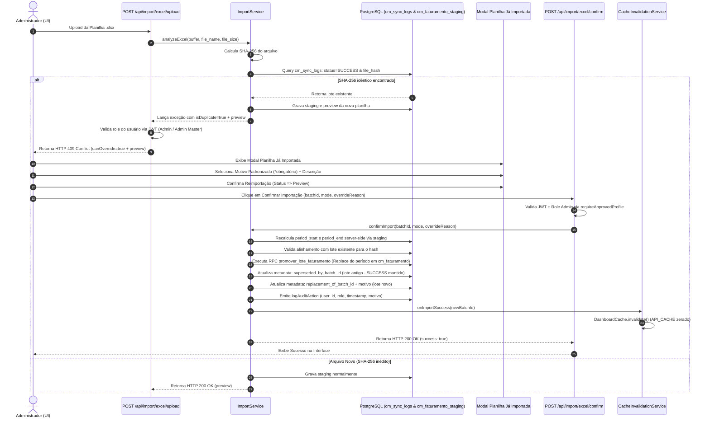

# DOCUMENTAÇÃO TÉCNICA — FLUXO DE REIMPORTAÇÃO CONTROLADA DE FATURAMENTO

**Plataforma**: Coffee++  
**Módulo**: Hub de Importação de Faturamento  
**Versão**: 1.0.0  
**Data**: 30 de Julho de 2026  
**Status**: Homologado em Produção (`main` commit `0308512` e `c5031ad`)  

---

## 1. ARQUITETURA DETALHADA DO FLUXO FIM A FIM



---

## 2. GARANTIAS ARQUITETURAIS MANDATÓRIAS

1. **Upload Nunca Altera Estado**: O endpoint `/api/import/excel/upload` é estritamente read-only em relação à produção (`cm_faturamento`). Sua função restringe-se a ler a planilha, calcular o SHA-256, gravar a staging temporária e gerar a prévia de análise.
2. **Confirm é o Único Responsável por Alterações de Estado**: Somente a rota `/api/import/excel/confirm` possui a capacidade transacional de promover registros para a produção (`cm_faturamento`), substituir períodos, vincular metadados e disparar invalidações.
3. **Nenhuma Decisão Crítica Depende do Front-end**: Parâmetros, flags ou booleanos enviados pela aplicação cliente jamais concedem autorização.
4. **Toda Autorização é Recalculada no Servidor**: A autenticação do token JWT, a checagem da role do perfil (`Admin` / `Admin Master`), o recálculo do período (`period_start` / `period_end`) e a presença da justificativa obrigatória são validados 100% server-side durante a confirmação.
5. **Histórico dos Lotes é Imutável**: O registro do lote original na `cm_sync_logs` permanece com seu status original `status = 'SUCCESS'`. A rastreabilidade é assegurada por ponteiros bidirecionais (`superseded_by_batch_id` no lote antigo e `replacement_of_batch_id` no novo lote).
6. **Toda Promoção Dispara Invalidação de Cache**: A conclusão de uma carga com status `SUCCESS` invoca automaticamente o `CacheInvalidationService.onImportSuccess(newBatchId)`, zerando o cache em memória e forçando o Dashboard a reconstruir a visão com dados frescos do PostgreSQL.

---

## 3. AUDITORIA E RASTREABILIDADE

A gravação da auditoria corporativa ocorre via `logAuditAction` com os atributos estruturados:

- `action`: `IMPORT_EXCEL_OVERRIDE_EXECUTED`
- `user_id`: ID do usuário autenticado no Supabase Auth
- `role`: Perfil do usuário (`Admin` ou `Admin Master`)
- `timestamp`: Data/hora exata em ISO-8601
- `motivo_padrao`: Valor padronizado (`Correção Fiscal`, `Correção de Faturamento`, `Reprocessamento Operacional`, `Homologação / Testes`, `Outro`)
- `motivo_descricao`: Texto descritivo preenchido quando `motivo_padrao === "Outro"`
- `old_batch_id`: UUID do lote original substituído
- `new_batch_id`: UUID do novo lote promovido

---

## 4. GOVERNANÇA E STATUS OFICIAL

- **Governança**: Incorporada como a **Seção 69 do `AGENTS.md`** ("Baseline Oficial — Reimportação Controlada de Faturamento").
- **Decision Record**: Registrado em **`ADR-003`** (`docs/architecture/adr/ADR-003-controlled-faturamento-reimport.md`).
- **Catálogo de Componentes**: Registrado em `docs/COMPONENT_CATALOG.md` com status `LTS` | `Stable` | `Governed`.

```text
STATUS FINAL DA PLATAFORMA:
IMPORT_HUB_STATUS = STABLE
CONTROLLED_REIMPORT_STATUS = STABLE
DASHBOARD_CACHE_STATUS = STABLE
CACHE_INVALIDATION_STATUS = HOMOLOGATED
GOVERNANCE = LOCKED & CONFIRMED
```
